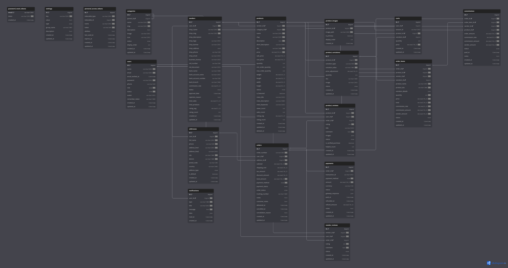

# 🛒 BazarBD

<div align="center">

**Bangladesh's Modern Multi-Vendor E-Commerce Platform**

*আপনার ডিজিটাল বাজার - সবকিছু এক জায়গায়*

[](https://laravel.com)
[](https://vuejs.org)
[](LICENSE)
[](https://github.com/YOUR_USERNAME/BazarBD)

[Features](#-features) • [Tech Stack](#-tech-stack) • [Database](#-database-design) • [Documentation](#-documentation) • [Timeline](#-development-timeline)

</div>

---

## 📖 About The Project

BazarBD is a comprehensive, full-stack multi-vendor e-commerce platform specifically designed for the Bangladeshi market. Built with modern technologies, it provides a seamless experience for vendors to sell their products and customers to shop conveniently online.

### Why BazarBD?

- 🇧🇩 **Bangladesh-Focused**: Built with local payment methods, language support, and delivery systems
- 🏪 **Multi-Vendor**: Unlimited vendors can join and sell products
- 💰 **Commission-Based**: Automated platform commission system
- 🔒 **Secure**: Industry-standard authentication and payment security
- 📱 **Mobile-First**: Responsive design optimized for mobile users
- ⚡ **Fast & Scalable**: Modern tech stack for high performance

---

## ✨ Features

### 🛍️ For Customers
- Browse products by categories
- Advanced search and filtering
- Shopping cart with real-time updates
- Multiple delivery addresses
- Secure checkout process
- Order tracking
- Product reviews and ratings
- Wishlist (Phase 2)
- Cash on Delivery (COD) support

### 🏪 For Vendors
- Easy shop registration and setup
- Product management (CRUD operations)
- Inventory tracking
- Order management dashboard
- Sales analytics and reports
- Commission tracking
- Review management
- Shop customization

### 👨‍💼 For Admins
- Vendor approval system
- Platform-wide analytics
- User and vendor management
- Category management
- Commission configuration
- Order oversight
- Product moderation
- System settings

---

## 🚀 Tech Stack

### Backend
- **Framework**: Laravel 12
- **Authentication**: Laravel Sanctum (API Token)
- **Database**: MySQL 8.0 / PostgreSQL
- **Cache**: Redis
- **Queue**: Laravel Queue
- **Storage**: Local / AWS S3 (configurable)

### Frontend
- **Framework**: Vue.js 3 (Composition API)
- **State Management**: Pinia
- **Routing**: Vue Router
- **HTTP Client**: Axios
- **UI Framework**: Tailwind CSS
- **Charts**: Chart.js / ApexCharts
- **Icons**: Lucide Icons

### DevOps & Tools
- **Version Control**: Git & GitHub
- **API Testing**: Postman
- **Code Quality**: ESLint, Prettier, PHPStan
- **Deployment**: Docker, GitHub Actions (CI/CD)

---

## 📊 Database Design

### ERD Diagram

<div align="center">

[](https://dbdiagram.io/d/6965802bd6e030a024d4ea08)

**[🔗 View Interactive ERD Diagram](https://dbdiagram.io/d/6965802bd6e030a024d4ea08)**

</div>

### Database Statistics
- **Total Tables**: 18
- **Core Tables**: users, vendors, products, orders
- **Support Tables**: categories, reviews, commissions, notifications
- **Total Relationships**: 25+
- **Normalization**: 3NF (Third Normal Form)

### Key Tables
| Table | Purpose | Relationships |
|-------|---------|---------------|
| `users` | All users (customers, vendors, admin) | → vendors, addresses, orders |
| `vendors` | Vendor/shop information | → products, commissions |
| `products` | Product catalog | → product_images, cart, orders |
| `orders` | Customer orders | → order_items, payments |
| `commissions` | Platform revenue tracking | → vendors, orders |

📄 **[View Complete Database Schema](docs/DATABASE_SCHEMA.md)**

---

## 📁 Project Structure

```
BazarBD/
├── backend/                    # Laravel API (Coming Soon)
│   ├── app/
│   │   ├── Http/Controllers/
│   │   ├── Models/
│   │   ├── Services/
│   │   └── Repositories/
│   ├── database/
│   │   ├── migrations/
│   │   ├── seeders/
│   │   └── factories/
│   ├── routes/
│   └── tests/
│
├── frontend/                   # Vue.js SPA (Coming Soon)
│   ├── src/
│   │   ├── components/
│   │   ├── views/
│   │   ├── stores/
│   │   ├── router/
│   │   └── services/
│   ├── public/
│   └── tests/
│
├── docs/                       # Documentation
│   ├── PROJECT_OVERVIEW.md
│   ├── FEATURE_LIST.md
│   ├── USER_STORIES.md
│   ├── DATABASE_SCHEMA.md
│   └── images/
│       └── erd-diagram.png
│
└── README.md                   # This file
```

---

## 📚 Documentation

Comprehensive documentation is available in the `/docs` folder:

| Document | Description |
|----------|-------------|
| [📋 Project Overview](docs/PROJECT_OVERVIEW.md) | Vision, objectives, and business model |
| [✨ Feature List](docs/FEATURE_LIST.md) | MVP, Phase 2, and Phase 3 features |
| [📖 User Stories](docs/USER_STORIES.md) | 75+ user stories for all user types |
| [🗄️ Database Schema](docs/DATABASE_SCHEMA.md) | Complete database design and relationships |

---

## 🎨 Design System

### Color Palette
```css
--primary: #059669      /* Emerald Green - Growth, Bangladesh */
--secondary: #DC2626    /* Red - Energy, Passion */
--accent: #F59E0B       /* Amber - Call-to-action */
--success: #10B981
--warning: #F59E0B
--danger: #EF4444
--info: #3B82F6
```

### Typography
- **Primary Font**: Inter (Clean, modern, supports Bangla)
- **Headings**: Poppins (600-700 weight)
- **Bangla Support**: Hind Siliguri / Noto Sans Bengali

---

## 📅 Development Timeline

| Phase | Duration | Status | Description |
|-------|----------|--------|-------------|
| **Week 1-2** | 14 days | ✅ Complete | Planning & Setup |
| **Week 3-6** | 28 days | 🔄 In Progress | Backend API Development |
| **Week 7-8** | 14 days | ⏳ Upcoming | Customer Frontend |
| **Week 9-10** | 14 days | ⏳ Upcoming | Vendor Dashboard |
| **Week 11-12** | 14 days | ⏳ Upcoming | Admin Panel |
| **Week 13** | 7 days | ⏳ Upcoming | Testing & Integration |
| **Week 14** | 7 days | ⏳ Upcoming | Deployment |

**Total Estimated Duration**: 14 weeks (3.5 months)

### Current Progress
- ✅ Day 1: Project planning and documentation complete
- ✅ Day 2: Database schema design complete
- ⏳ Day 3-7: Environment setup and database migration (Next)

---

## 🔧 Installation & Setup

> **Note**: Backend and frontend setup instructions will be added once development begins.

### Prerequisites
- PHP 8.2+
- Composer
- Node.js 18+
- MySQL 8.0+ / PostgreSQL
- Redis (optional but recommended)

### Quick Start
```bash
# Clone the repository
git clone https://github.com/YOUR_USERNAME/BazarBD.git
cd BazarBD

# Backend setup (Coming Soon)
cd backend
composer install
cp .env.example .env
php artisan key:generate
php artisan migrate --seed

# Frontend setup (Coming Soon)
cd ../frontend
npm install
npm run dev
```

---

## 🧪 Testing

Testing strategy (To be implemented):

- **Backend**: PHPUnit for unit and feature tests
- **Frontend**: Vitest + Vue Test Utils
- **E2E**: Cypress
- **API**: Postman Collections

Target coverage: 80%+

---

## 🚀 Deployment

Deployment will support:

- **Backend**: DigitalOcean Droplet / AWS EC2
- **Frontend**: Vercel / Netlify
- **Database**: Managed MySQL / PostgreSQL
- **Storage**: AWS S3 / DigitalOcean Spaces
- **SSL**: Let's Encrypt
- **CI/CD**: GitHub Actions

---

## 🎯 Roadmap

### Phase 1: MVP (Week 1-12) ✅ In Progress
- [x] Project planning and documentation
- [x] Database design
- [ ] Backend API development
- [ ] Customer-facing frontend
- [ ] Vendor dashboard
- [ ] Admin panel
- [ ] Payment integration (Stripe + COD)
- [ ] Email notifications

### Phase 2: Enhancements (Month 4)
- [ ] Product variations (size, color)
- [ ] Product reviews & ratings
- [ ] Wishlist functionality
- [ ] Order tracking
- [ ] Advanced analytics
- [ ] Discount & coupon system
- [ ] Local payment methods (bKash, Nagad, Rocket)

### Phase 3: Advanced Features (Month 5+)
- [ ] Real-time chat system
- [ ] Push notifications
- [ ] Multi-language support (Bangla)
- [ ] Mobile app (React Native)
- [ ] Social media integration
- [ ] Advanced SEO optimization
- [ ] Blog section

---

## 📈 Key Metrics (Target)

| Metric | Target | Status |
|--------|--------|--------|
| API Response Time | < 200ms | ⏳ |
| Page Load Time | < 2s | ⏳ |
| Test Coverage | > 80% | ⏳ |
| Mobile Score | > 90 | ⏳ |
| Security Grade | A+ | ⏳ |

---

## 🤝 Contributing

This is a portfolio project, but suggestions and feedback are welcome!

1. Fork the project
2. Create your feature branch (`git checkout -b feature/AmazingFeature`)
3. Commit your changes (`git commit -m 'Add some AmazingFeature'`)
4. Push to the branch (`git push origin feature/AmazingFeature`)
5. Open a Pull Request

---

## 📝 License

This project is created for portfolio purposes.

---

## 👨‍💻 Author

**Your Name**

- 🌐 Portfolio: [Hasibul Alam.com](https://hasibulalam.com)
- 💼 LinkedIn: [Hasibul Alam ](https://www.linkedin.com/in/hasibul-alam-web-dev/)
- 📧 Email: hasibulalam108@gmail.com
- 🐙 GitHub: [@HASIBULALAMH ](https://github.com/HASIBULALAMH)

---

## 🙏 Acknowledgments

- Laravel team for the amazing framework
- Vue.js community for the reactive framework
- dbdiagram.io for the ERD visualization
- All open-source contributors

---

## 📞 Support & Feedback

If you have any questions, suggestions, or feedback:

- 📧 Email: hasibulalam108@gmail.com
- 💬 Open an [Issue](https://github.com/HASIBULALAMH/BazarBD/issues)
- 🌟 Star this repo if you find it useful!

---

<div align="center">

**Built with ❤️ for the Bangladesh market**

⭐ Star this repository if you find it interesting!

[Report Bug](https://github.com/HASIBULALAMH/BazarBD/issues) • [Request Feature](https://github.com/HASIBULALAMH/BazarBD/issues)

---

**Status**: 🚧 In Development - Day 2 Complete (Database Design)

**Last Updated**: January 13, 2026

</div>
